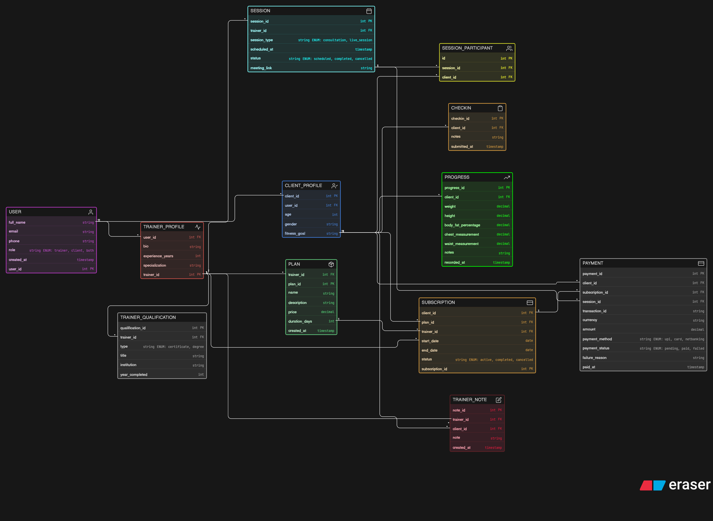

# 🏋️ Fitness Coaching Platform – ER Diagram

## 📌 Overview

This project is about designing a database for an online fitness coaching platform. The idea is based on how fitness influencers manage clients through plans, sessions, and regular progress tracking.

As the platform grows, it needs a proper system to handle users, subscriptions, sessions, and payments in a structured way.

---

## 🎯 What this system handles

* Trainers and clients with separate profiles
* Fitness plans created by trainers
* Clients subscribing to different plans over time
* Scheduling consultations and live sessions
* Tracking progress like weight and body measurements
* Managing payments for plans and sessions

---

## 🧠 Design Approach

Instead of mixing everything in one table, the design keeps things separate and organized:

* `USER` is kept generic, and roles are handled using trainer and client profiles
* Plans and subscriptions are separated so we can track purchases properly
* Sessions and check-ins are treated differently since they serve different purposes
* Progress data is stored separately to track changes over time
* Trainer qualifications are stored to reflect real-world credibility

---

## 🔗 Relationships (in simple terms)

* A trainer can manage multiple clients and create multiple plans
* A client can subscribe to multiple plans over time
* One plan can be taken by many clients
* Sessions can have one or more participants
* Clients can submit multiple check-ins and progress records

---

## 🖼️ ER Diagram

---

## 🙌 Final Thoughts

This design focuses on keeping the system practical and scalable while matching how real online coaching platforms work.

---
